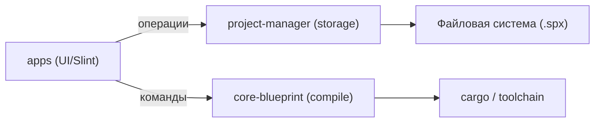

# Архитектура Snappix

## Обзор

Snappix разделен на две основные зоны:

- `apps/` — UI-слой и пользовательские сценарии (Slint, callbacks, взаимодействие с системой).
- `crates/` — ядро: хранение проекта, формат `.spx`, компиляция блюпринтов.

## Высокоуровневая схема

## Основные компоненты

### apps

- `editor_runtime/*` — обработчики действий пользователя, история, синхронизация UI.
- `app/project.rs` — модель проекта (страницы, элементы, ассеты) и операции над ними.
- `app/associations.rs` — файловые ассоциации `.spx` на Linux.

### crates

- `project-manager` — запись/чтение `.spx`, история (`timeline.bin`), ассеты.
- `core-blueprint` — компиляция блюпринтов и диагностика.
- `shared` — общие типы и ошибки.

## Поток загрузки/сохранения

1. UI вызывает операции из `project-manager`.
2. `project-manager` читает/пишет ZIP-архив `.spx`.
3. Бинарные данные проекта хранятся в MessagePack.
4. Ассеты извлекаются в `assets/` рядом с архивом.

## История изменений

- Хранится в `history/timeline.bin` внутри `.spx`.
- В памяти поддерживается до 100 последних изменений.

## Ассеты изображений

- Все изображения хранятся в `assets/images/<uuid>.<ext>`.
- При удалении объекта или комментария ассеты очищаются, если больше не используются.

## Границы ответственности

- UI отвечает за удобство и реакцию на действия пользователя.
- Ядро отвечает за формат `.spx`, сохранение, загрузку и диагностику.
- Тяжелые операции (например, чтение/запись архивов) выполняются в ядре, UI только инициирует вызовы.

